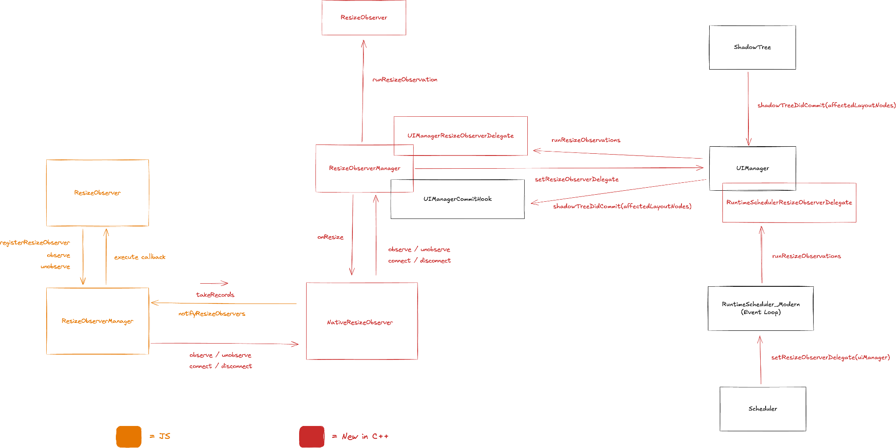

# ResizeObserver

[🏠 Home](../../../../../../../__docs__/README.md)

This directory contains the React Native implementation of the
[ResizeObserver API](https://developer.mozilla.org/en-US/docs/Web/API/ResizeObserver).

## 🚀 Usage

`ResizeObserver` is meant to be used from JavaScript, exposed as a global class.

## 📐 Design

This is the high-level design of the ResizeObserver API:

The global `ResizeObserver` class is defined in JavaScript and it does its setup
using a native module.

In native, it relies on commit hooks from `UIManager` to learn which nodes had
layout updates after each commit (`shadowTreeDidCommit` with the affected layout
nodes). The commit hook records which observed targets may have resized. A
dedicated step in the Event Loop (as specified in the Web spec, via
`RuntimeSchedulerResizeObserverDelegate`) then runs resize observations against
the latest committed tree and notifies JavaScript when there are pending
entries. JavaScript pulls those entries via `takeRecords` and dispatches them to
the right observers.

Unlike layout events (`onLayout`), `ResizeObserver` lets callers choose which
box to observe (`content-box`, `border-box`, or `device-pixel-content-box`) and
delivers sizes for those boxes in the notification. Notifications are delivered
from the «update the rendering» step of the Event Loop (via
`RuntimeSchedulerResizeObserverDelegate`) — after the task that committed the
layout change and that task's microtask checkpoint, not synchronously when
layout is computed.

## 🔗 Relationship with other systems

### Part of this

- [NativeResizeObserver C++ TurboModule](../../../../../ReactCommon/react/nativemodule/resizeobserver/__docs__/README.md).
- [C++ implementation](../../../../../ReactCommon/react/renderer/observers/resize/__docs__/README.md).

### Used by this

- This relies on `ShadowTree` commit hooks provided by `UIManager`, including
  the list of nodes whose layout changed after each commit.
- It uses the C++ TurboModule infra for communication between JavaScript and
  native.
- It uses the
  [`Event Loop`](../../../../../ReactCommon/react/renderer/runtimescheduler/__docs__/README.md)
  to run resize observations as a dedicated step.

### Uses this

- This is an API meant to be used by end users. It is not used directly by any
  other parts of the platform.
